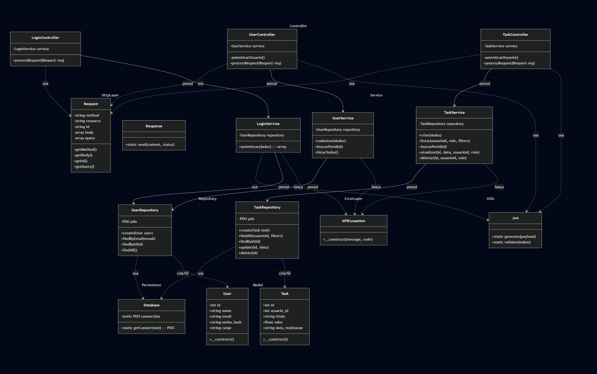

# Simple Task Manager Api

---

## Tecnologias Utilizadas

* **Linguagem:** PHP 8+ (Puro, sem frameworks)
* **Banco de Dados:** SQLite
* **Autenticação:** JWT (JSON Web Token)

## Funcionalidades

* **CRUD de Relatórios:** Criar, listar, atualizar e excluir relatórios de serviço.
* **Autenticação JWT:** Proteção de rotas via Token Bearer.
* **Isolamento de Dados:** Usuários comuns veem apenas os seus próprios relatórios.
* **Segurança:** Senhas com hash (bcrypt) e proteção contra injeção SQL (PDO).
* **Exportação para CSV:**
    * **Usuários (Admin):** Administradores podem exportar a lista completa de usuários para um arquivo CSV.
    * **Relatórios:** Usuários autenticados podem exportar seus relatórios para um arquivo CSV.

## Arquitetura e Padrões do Projeto

### Arquitetura em Camadas (Controller-Service-Repository)

O sistema estende o padrão **MVC** clássico para uma arquitetura mais robusta, garantindo a **Separação de Responsabilidades** (*Separation of Concerns*):

* **Controller:** Responsável apenas por lidar com a camada HTTP (receber a requisição, capturar dados e devolver a resposta JSON). Não contém regras de negócio.
* **Service:** Contém todas as **regras de negócio**, validações e lógica. É agnóstico ao protocolo HTTP ou ao tipo de base de dados.
* **Repository:** Camada exclusiva de acesso aos dados (SQL). Isola as queries e a comunicação com o banco de dados do restante do sistema.
* **Model:** Representação pura das entidades (DTOs) que trafegam entre as camadas.

### Padrão PSR-4

A estrutura de diretórios e nomes de ficheiros segue rigorosamente a recomendação **PSR-4** (PHP Standards Recommendation) para facilitar o **Autoloading** nativo.

* **PascalCase:** Todas as classes e nomes de ficheiros utilizam a notação *PascalCase* (ex: `TaskController.php`, `UserService.php`), onde a primeira letra de cada palavra é maiúscula.

* **Namespaces:** Os namespaces refletem exatamente a estrutura física das pastas (ex: `namespace Controller;` refere-se à pasta `src/Controller/`).

## Estrutura do Projeto

```text
simple-task-manager-api/
├── assets/
│   ├── diagrama_classe.png # Diagrama UML das classes
│   └── diagrama_db.png # Diagrama ER do Banco de Dados
├── src/
│   ├── Controller/     # Controladores (Entrada da API)
│   ├── Database/       # Conexão e Setup do SQLite
│   ├── Error/          # Exceções personalizadas
│   ├── Http/           # Classes Request e Response
│   ├── Model/          # Definição dos Objetos (Entidades)
│   ├── Repository/     # Acesso ao Banco de Dados (SQL)
│   ├── Service/        # Regras de Negócio e Validações
│   ├── Utils/          # Utilitários (JWT)
│   └── config.php      # Configurações e Autoloader
├── tools/              # Arquivos de exportação (Insomnia/HAR)
├── .gitignore          # Arquivos ignorados pelo Git
├── .htaccess           # Configuração de rotas (Apache)
├── index.php           # Front Controller (Roteador)
├── *.http              # Arquivos de teste (login, tasks, users)
└── README.md           # Documentação
```

## Modelo de Classes



## Como executar o projeto

1. Clonar o repositório

```bash
git clone https://github.com/CaputiDev/simple-task-manager-api
```

2. Configurar o Banco de Dados

Na raiz do projeto, execute o script de setup para criar as tabelas e popular com dados de teste:

```bash
php src/Database/setup.php
```

## Modelo ER do Banco de dados


### Usuários de Teste (seed)

O script de setup cria automaticamente os seguintes usuários:

| ID| Nome   | Email               |  Senha  | Cargo |
|---|--------|---------------------|---------|-------|
| 1 | Admin  | `admin@admin.com`   | admin   | Admin |
| 2 | Thiago | `thiago@email.com`  | senha123| User  |
| 3 | Miguel | `miguel@email.com`  | senha123| User  |
| 4 | Raul   | `raul@email.com`    | senha123| User  |

3. Iniciar o Servidor

Na raiz do projeto, inicie o servidor (pode utilizar o embutido do PHP ou outro servidor web):

```bash
php -S localhost:80
```

---

## Rotas da API

Todas as rotas, exceto `/login`, são protegidas e exigem um `Bearer Token` no cabeçalho `Authorization`.

### Autenticação

| Método | Rota    | Descrição                  |
|--------|---------|----------------------------|
| `POST` | /login  | Autentica um usuário e retorna um token JWT. |

### Usuários

| Método | Rota         | Descrição                                   |
|--------|--------------|---------------------------------------------|
| `GET`  | /usuarios    | **(Admin)** Lista todos os usuários.         |
| `GET`  | /usuarios?format=csv | **(Admin)** Exporta a lista de usuários para CSV. |

### Relatórios (Tasks)

| Método | Rota         | Descrição                                      |
|--------|--------------|------------------------------------------------|
| `GET`  | /relatorios  | Lista os relatórios do usuário autenticado.    |
| `GET`  | /relatorios?format=csv | Exporta os relatórios do usuário para CSV.     |
| `POST` | /relatorios  | Cria um novo relatório.                        |
| `PUT`  | /relatorios/{id} | Atualiza um relatório existente.               |
| `DELETE`| /relatorios/{id} | Deleta um relatório.                           |

## Colaboradores

<div align="center">

<table>
  <tr>
    <td align="center">
      <a href="https://github.com/caputidev">
        <br>
        <sub><b>Thiago Caputi</b></sub>
      </a>
    </td>
    <td align="center">
      <a href="https://github.com/raullize">
        <br>
        <sub><b>Raul Lize Teixeira</b></sub>
      </a>
    </td>
    <td align="center">
      <a href="https://github.com/MiguelLewandowski">
        <br>
        <sub><b>Miguel Leonardo Lewandowski</b></sub>
      </a>
    </td>
  </tr>
</table>

</div>